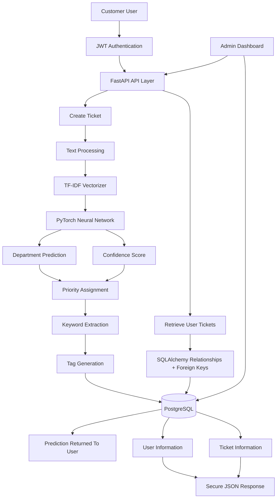
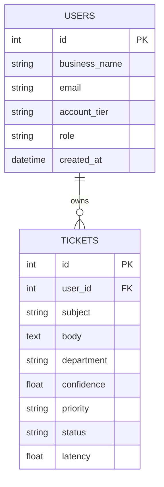
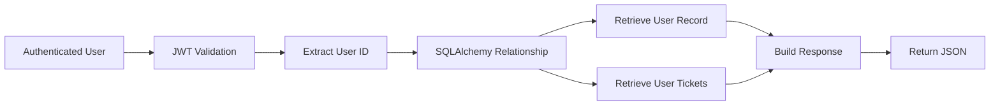
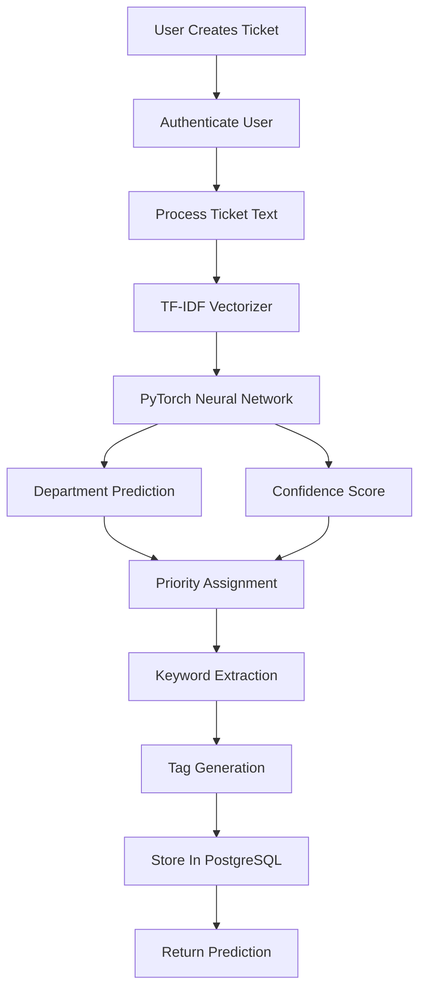
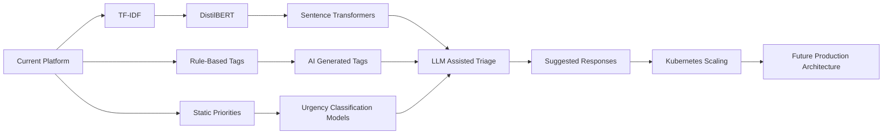

# AI-Powered Ticket Intelligence Platform

## System Architecture Overview



---

## Ticket Ownership & Security Architecture



---

## Secure User Retrieval Flow



---

## Example Secure User Response

I wanted to make sure users could never access another user's information.

To achieve this, I used both foreign keys and SQLAlchemy relationships, making it easy to connect users to their tickets while maintaining security.

The response includes both user information and ticket details.

```json
{
  "user": {
    "business_name": "SoloDev",
    "email": "testingthings@gmail.com",
    "account_tier": "Free",
    "id": 2,
    "created_at": "2026-05-21T17:18:14.656050+01:00",
    "role": "customer"
  },
  "tickets": [
    {
      "id": 17,
      "user_id": 2,
      "subject": "Urgent: Account Locked and Cannot Update Profile Email Address",
      "body": "I am trying to complete a profile_update but my corporate profile is completely locked. I am receiving errors saying domain login permissions are missing. Please transfer this to a supervisor for immediate escalation.",
      "department": "Technical Support",
      "confidence": 0.76,
      "priority": "High",
      "tags": [
        "active_directory",
        "internal_hiring"
      ],
      "extracted_keywords": [
        "email",
        "transfer",
        "account locked"
      ],
      "status": "Queued",
      "latency": 39.0
    }
  ]
}
```

---

## Ticket Creation & AI Routing Pipeline



---

## Example Ticket Processing Output

Then came the main feature.

**Ticket creation.**

When a user creates a ticket, the system:

1. Authenticates the user
2. Processes the text
3. Runs inference through the PyTorch model
4. Predicts the correct department
5. Generates confidence scores
6. Assigns priority
7. Extracts keywords
8. Generates tags
9. Stores everything in PostgreSQL
10. Returns the prediction back to the user

For example:

```json
{
  "id": 3,
  "user_id": 3,
  "subject": "Transaction Declined: Stripe Payment Failure on Monthly Subscription Renewal",
  "body": "I just received an alert stating that our automated monthly subscription renewal failed. The log states our primary credit card transaction was declined by the payment gateway processor. We haven't changed our payment_method, so I'm not sure why this error suddenly popped up on your system.",
  "department": "Billing and Payments",
  "confidence": 1.0,
  "priority": "High",
  "tags": [
    "subscription_cycle",
    "payment_method",
    "payment_failure"
  ],
  "status": "Queued",
  "latency": 82.0
}
```

## Engineering Evolution Roadmap



## 1. TF-IDF vs Transformer Models

The current version of the system uses a **TF-IDF vectorizer** for feature extraction.

```python
vectorizer = TfidfVectorizer(
    max_features=5000,
    ngram_range=(1, 2),
    stop_words="english"
)
```

# Engineering Tradeoffs & Design Decisions

### Why TF-IDF?

#### Advantages

- Fast training and inference
- Low memory requirements
- Easy to deploy inside FastAPI
- Lightweight for CPU-only environments
- Easy to debug and explain

#### Limitations

- Does not understand semantic meaning
- Cannot capture contextual relationships
- Relies heavily on vocabulary overlap

For example:

```text
"Unable to login"
```

```text
"Cannot access my account"
```

Both sentences have similar intent, but TF-IDF may treat them as entirely different feature sets.

### Future Upgrade

```text
TF-IDF
   ↓
DistilBERT
   ↓
Sentence Transformers
```

Transformer embeddings will provide:

- Better contextual understanding
- Improved routing accuracy
- Semantic similarity capabilities
- Future support for LLM-assisted workflows

#### Tradeoffs

- Increased GPU requirements
- Higher inference latency
- Greater infrastructure costs

---

## 2. Rule-Based Tags vs AI-Generated Tags

The current implementation uses a **deterministic rule-based tagging engine**.

```python
TAG_KEYWORDS = {
    "billing": ["payment", "refund", "charged"],
    "authentication": ["login", "password", "otp"],
    "security": ["hack", "breach"],
    "technical": ["bug", "error", "crash"]
}
```

### Why Rule-Based?

#### Advantages

- Predictable outputs
- Easy to audit
- Zero additional model cost
- Fast execution

#### Limitations

- Limited flexibility
- Requires manual maintenance
- Cannot understand unseen phrasing

### Future Upgrade

Transformer-based models will generate:

- Tags
- Priorities
- Ticket summaries
- Suggested responses

---

## 3. Static Priority Rules vs Learned Priorities

Current priorities are generated using **business logic rules**.

### Example

```python
if confidence > 0.90:
    priority = "High"
elif confidence > 0.70:
    priority = "Medium"
else:
    priority = "Low"
```

### Advantages

- Transparent behavior
- Easy to modify
- Consistent results

### Limitations

- Rules may not capture real-world urgency
- Requires manual tuning

### Future Upgrade

```text
Transformer Embeddings
        +
Urgency Classification Models
```

These models will be used to predict urgency dynamically based on ticket content.

---

## 4. JWT Authentication vs Session-Based Authentication

Authentication is implemented using **JWT access tokens**.

### Example

```python
access_token = create_access_token(
    data={"user_id": user.id}
)
```

### Advantages

- Stateless architecture
- Scales well across services
- Industry-standard approach
- Ideal for API-driven systems

### Limitations

- Token revocation complexity
- Requires expiration management

### Why JWT?

JWT was selected because the long-term vision includes:

- Multiple services
- Docker containers
- Cloud deployment
- Future microservice architecture

---

## 5. SQLAlchemy ORM vs Raw SQL

Database operations are performed using **SQLAlchemy ORM**.

### Example

```python
new_ticket = Ticket(
    subject=ticket.subject,
    body=ticket.body,
    department=prediction
)

db.add(new_ticket)
db.commit()
```

### Advantages

- Faster development
- Cleaner codebase
- Better maintainability
- Model-based relationships

### Limitations

- Additional abstraction layer
- Slight performance overhead compared to raw SQL

### Design Decision

For this project, **maintainability was prioritized over raw query performance**.

---

## 6. Current Model Architecture vs Future Architecture

### Current Routing Pipeline

```text
Ticket
   ↓
TF-IDF Vectorizer
   ↓
PyTorch Neural Network
   ↓
Department Prediction
   ↓
Confidence Score
   ↓
Tag Generation
   ↓
Database Storage
```

### Future Architecture

```text
Ticket
   ↓
DistilBERT Encoder
   ↓
Transformer Classifier
   ↓
Urgency Scoring
   ↓
Tag Generation
   ↓
LLM-Assisted Triage
   ↓
Suggested Responses
   ↓
Database Storage
```

---

# Deployment Roadmap

The platform is currently under active development.

### Current Deployment Target

```text
Client
   ↓
FastAPI
   ↓
PyTorch Model
   ↓
PostgreSQL
```

### Containerization

```text
Docker
```

### CI/CD Automation

```text
GitHub Actions
```

### Planned Cloud Deployment

```text
Microsoft Azure
```

### Future Scaling Strategy

```text
Docker
   ↓
Kubernetes
   ↓
Multi-Service Deployment
```

---

# Key Engineering Lesson

One of the biggest lessons from this project is that **production AI systems are not simply machine learning models**.

They are composed of multiple interconnected layers:

- Authentication
- Data Validation
- Model Inference
- Database Design
- API Design
- Monitoring
- Deployment Infrastructure

---

## Final Reflection

The goal of this project is not only to build a high-performing ticket routing model, but to engineer a **complete AI-powered support platform** that mirrors the architecture, tradeoffs, and operational considerations found in real-world production systems.

By balancing **performance**, **maintainability**, **scalability**, and **future extensibility**, the platform is being designed as a foundation that can evolve from traditional machine learning workflows into modern transformer-based and LLM-assisted support systems.
